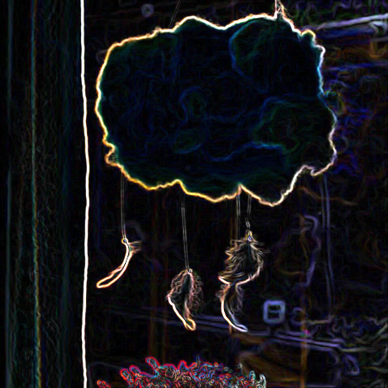

[](https://classroom.github.com/a/N9V_XO6i)
[](https://classroom.github.com/online_ide?assignment_repo_id=23784635&assignment_repo_type=AssignmentRepo)
# GPU Image Processing Pipeline using CUDA | CS 147 Spring 2026 Final Project

## Hishaam Abdul-Muhaimin

## Project Overview

This project implements a GPU-accelerated image processing pipeline using CUDA. The application performs Gaussian blur and Sobel edge detection on images. Both CPU and GPU implementations were developed to compare performance and demonstrate the benefits of parallel processing on GPUs.

The project loads an input image, applies image processing filters, saves the processed outputs, and reports execution times for both CPU and GPU implementations.

## GPU Acceleration

We find that the GPU accelerates the image processing pipeline by doing execute image operations in parallel using CUDA kernels.

Instead of us processing the pixels sequentially on the CPU thousands of GPU threads can process pixels simultaneously.

### Parallel Algorithm

Both the Gaussian blur and Sobel edge detection filters were implemented as CUDA kernels. 

And so each thread is responsible for computing the output value for a single pixel so this allows many pixels to be processed concurrently.

### Thread and Block Organization

The image is divided into a two dimensional grid of CUDA thread blocks. A block size of 16 x 16 threads was used. The grid dimensions are calculated based on the image width and height so that every pixel is assigned to a thread.

## Features

- Image loading using stb_image
- Image saving using stb_image_write
- CPU Gaussian blur
- GPU Gaussian blur using CUDA
- CPU Sobel edge detection
- GPU Sobel edge detection using CUDA
- Performance benchmarking
- CUDA event timing

## Technologies Used

- CUDA
- C++
- stb_image
- stb_image_write

## Project Structure

- images/ : input images
- results/ : output images
- include/ : image libraries
- src/ : source code
- Makefile : build instructions
- README.md : documentation

## Build Instructions

Compile the project:

```bash
make clean
make

## Run Instructions

Place an image named:

```text
images/test.png
```

Run:

```bash
./gpu_image_pipeline
```

## Output Files

Generated images are stored in:

```text
results/cpu_blur.png
results/gpu_blur.png
results/cpu_sobel.png
results/gpu_sobel.png
```
## CUDA Implementation

The GPU implementation assigns image pixels to CUDA threads.

- Thread Block Size: 16 x 16
- One thread processes one pixel
- CUDA kernels are used for Gaussian blur and Sobel edge detection

## Output Comparison

### Original Image


### CPU Gaussian Blur


### GPU Gaussian Blur


The CPU and GPU Gaussian blur implementations produced visually equivalent results.

### CPU Sobel Edge Detection



### GPU Sobel Edge Detection


The CPU and GPU Sobel implementations produced visually equivalent edge detection results while the GPU achieved significantly faster execution times.

## Example Results

Image Resolution: 1456 x 816

CPU Blur Time: 30.3428 ms

GPU Blur Time: 255.762 ms

GPU Blur Kernel Time: 0.191456 ms

CPU Sobel Time: 49.6262 ms

GPU Sobel Time: 2.03548 ms

Sobel Speedup: 24.3806x

GPU Sobel Kernel Time: 0.08288 ms

Sobel Kernel Speedup: 598.771x

## Author Contribution

Project Design: 100%

CPU Gaussian Blur: 100%

GPU Gaussian Blur: 100%

CPU Sobel Edge Detection: 100%

GPU Sobel Edge Detection: 100%

Benchmarking: 100%

Documentation: 100%

## Problems Faced

There were several problems faced during this project. One challenge was learning how to implement image processing algorithms using CUDA kernels since this was my first time working with this type of GPU programming.

Another challenge was managing memory between the CPU and GPU and making sure the GPU output matched the CPU output. There were also times where debugging the code was difficult because it was not always obvious where an error was coming from.

Performance testing was another challenge. At first the GPU blur results looked much slower than expected because the timing included memory allocation and memory transfers. After further testing CUDA event timing was used to get more accurate kernel execution times.

Finally image loading and saving required additional testing to make sure different images could be processed correctly and that the output files were generated properly.

## Conclusion

This project successfully implemented a GPU-accelerated image processing pipeline using CUDA. Gaussian blur and Sobel edge detection were developed for both CPU and GPU execution and tested on multiple images. The CPU and GPU implementations produced visually equivalent results which confirmed the correctness of the CUDA kernels.

Performance measurements showed that GPU parallelism can significantly accelerate image processing tasks especially for Sobel edge detection. The GPU implementation achieved better speedups compared to the CPU version while maintaining output quality. Overall project demonstrates how CUDA can be used to improve the performance of computationally intensive image processing applications.


